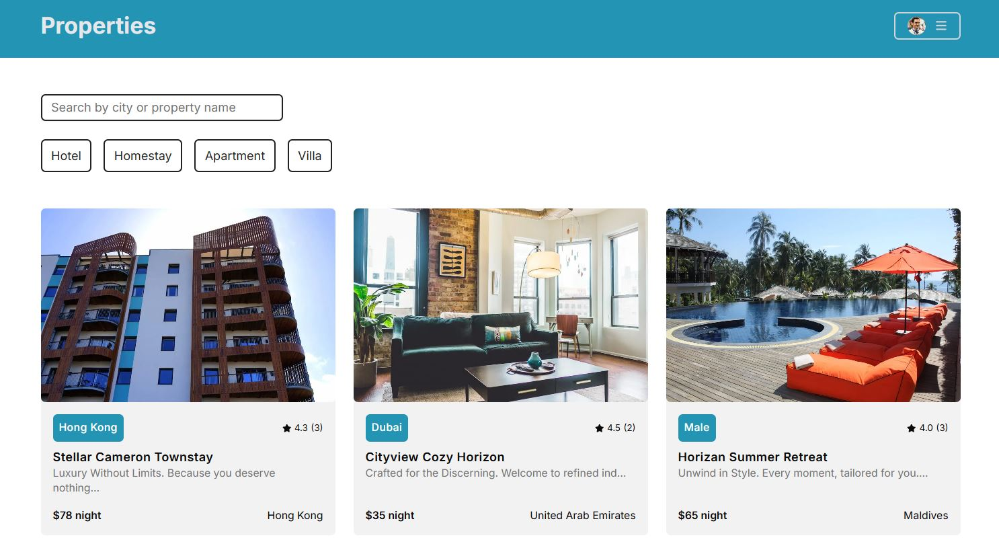
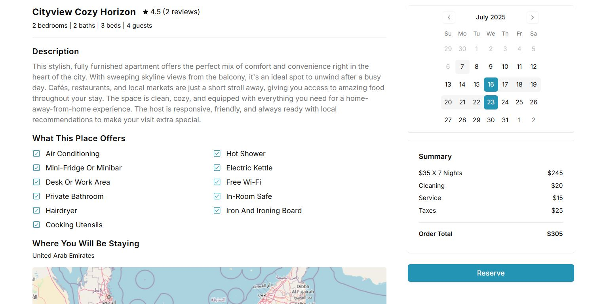

## Next.js Property Rental Project

**Project URL:**
https://nextjs-property-rental-project.vercel.app/

**Project Features**
- Disabled dates for other users for existing bookings.
- Secure login with Clerk Auth. Admin only route to view application stats.
- Users can create and update profile. Image upload and update functionality.
- Filter options based on property type, property name and city.
- Add to favorite and write review functionality.
- Edit rental and delete rental functionality.
- Booking stats for user's own rentals (total revenue and total days booked).
- Custom error handler to capture and display errors for every route.
- Hosted on Vercel.

**Home Page**

**Booking Page**

**Favorites Page**

**Rentals Page**

**Reviews Page**

**Create Rental Page**

